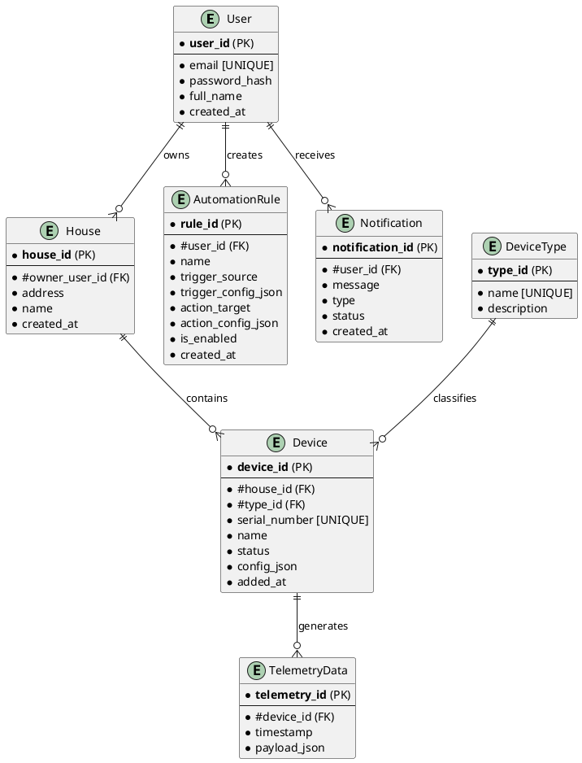

# Project_template

Это шаблон для решения проектной работы. Структура этого файла повторяет структуру заданий. Заполняйте его по мере работы над решением.

# Задание 1. Анализ и планирование
### 1. Описание функциональности монолитного приложения

**Управление отоплением:**

    * Пользователи могут удаленно включать и выключать систему отопления в своем доме через веб-интерфейс.
    * Система поддерживает только управление отоплением, другие типы устройств не предусмотрены.
    * Подключение и настройка выполняются только специалистом компании.

**Мониторинг температуры:**

	* Пользователи могут просматривать текущую температуру в своих домах через веб-интерфейс.
    * Система поддерживает получение данных о температуре путем активного опроса датчиков сервером.

### 2. Анализ архитектуры монолитного приложения

* **Язык программирования:** Java
* **База данных:** PostgreSQL
* **Архитектура:** Монолитная. Вся логика (веб-интерфейс, управление отоплением, опрос датчиков, работа с БД) находится в одном приложении.
* **Взаимодействие:** Полностью синхронное. Запросы от сервера к датчикам обрабатываются последовательно.
* **Масштабируемость:** Низкая. Невозможно масштабировать отдельные компоненты независимо.
* **Развертывание:** Требует полной остановки и перезапуска всего приложения. Отсутствует CI/CD.
* **Расширяемость:** Затруднена. Добавление новых типов устройств или функций требует модификации всего монолита.

### 3. Определение доменов и границы контекстов

На основе текущей функциональности и планов по развитию (SaaS, самообслуживание, новые типы устройств) я предлагаю выделить следующие ключевые домены и ограниченные контексты:

1.  **Управление Пользователями и Доступом (User & Access Management):** Регистрация, аутентификация, авторизация, управление профилями и домами пользователей
2.  **Управление Устройствами (Device Management):** Регистрация, конфигурация, отправка команд на устройства различных типов (отопление, свет, ворота и т.д.), получение статуса
3.  **Сбор и Обработка Телеметрии (Telemetry Processing):** Прием, хранение и предоставление доступа к данным с датчиков (температура, состояние и т.д.)
4.  **Сценарии и Автоматизация (Automation & Scenarios):** Пользовательская настройка правил взаимодействия устройств.
5.  **Оповещения (Notifications):** Отправка уведомлений пользователям о событиях системы

### **4. Проблемы монолитного решения**

Монолитная архитектура создает следующие проблемы для реализации новых бизнес-целей:

* **Низкая скорость разработки:** Добавление поддержки новых типов устройств или изменение логики затрагивает всю кодовую базу, замедляя разработку и увеличивая риски
* **Проблемы с масштабируемостью:** Модель SaaS требует гибкого масштабирования, что невозможно для монолита
* **Низкая отказоустойчивость:** Ошибка в одном компоненте может привести к отказу всей системы.
* **Сложность внедрения технологий:** Трудно использовать разные, наиболее подходящие технологии для разных задач (например, time-series DB для телеметрии)
* **Затрудненное развертывание:** Обновления требуют простоя системы, что неприемлемо для SaaS. CI/CD для монолита сложен
* **Невозможность самообслуживания:** Архитектура не поддерживает самостоятельное подключение устройств пользователями

### 5. Визуализация контекста системы — диаграмма С4

```plantuml
@startuml C4_Context_AsIs
!include https://raw.githubusercontent.com/plantuml-stdlib/C4-PlantUML/master/C4_Context.puml

LAYOUT_WITH_LEGEND()

Person(user, "Пользователь", "Клиент системы 'Тёплый дом'")
System(heating_system, "Система 'Тёплый дом' (Монолит)", "Java-приложение + Postgres")
System(sensor, "Датчик Отопления", "Физическое устройство в доме")

Rel(user, heating_system, "Управляет отоплением, смотрит температуру", "HTTPS/Web")
Rel(heating_system, sensor, "Запрашивает температуру, отправляет команды", "Проприетарный протокол")

@enduml
```

# Задание 2. Проектирование микросервисной архитектуры

В этом задании вам нужно предоставить только диаграммы в модели C4. Мы не просим вас отдельно описывать получившиеся микросервисы и то, как вы определили взаимодействия между компонентами To-Be системы. Если вы правильно подготовите диаграммы C4, они и так это покажут.

**Диаграмма контейнеров (Containers)**

```plantuml
@startuml C4_Container_ToBe
!include https://raw.githubusercontent.com/plantuml-stdlib/C4-PlantUML/master/C4_Container.puml

Person(user, "Пользователь", "Клиент экосистемы")
System_Ext(iot_device, "Умное Устройство", "Датчики, реле")

System_Boundary(c1, "Экосистема 'Тёплый Дом'") {
    Container(spa, "Веб/Мобильное Приложение",  "Клиентский интерфейс")
    Container(api_gateway, "API Gateway", "Точка входа, маршрутизация, аутентификация")

    ContainerDb(user_db, "User DB", "PostgreSQL", "Хранение данных пользователей и домов")
    Container(user_service, "UserService", "Управление пользователями и доступом")

    ContainerDb(device_db, "Device DB", "PostgreSQL", "Хранение данных об устройствах")
    Container(device_service, "DeviceService", "Управление устройствами и командами")

    ContainerDb(telemetry_db, "Telemetry DB", "TimescaleDB / InfluxDB", "Хранение временных рядов телеметрии")
    Container(telemetry_service, "TelemetryService", "Прием и обработка телеметрии")

    ContainerDb(automation_db, "Automation DB", "PostgreSQL", "Хранение сценариев и правил")
    Container(automation_service, "AutomationService", "Выполнение сценариев автоматизации")

    Container(notification_service, "NotificationService", "Отправка уведомлений")

    Container(kafka, "Kafka", "Асинхронная шина сообщений")
}

System_Ext(email_service, "Email Service", "Внешний сервис отправки Email")
System_Ext(push_service, "Push Notification Service")

' Связи пользователя и внешних систем
Rel(user, spa, "Использует", "HTTPS")
Rel(iot_device, api_gateway, "Отправляет телеметрию (через HTTP)", "HTTPS/MQTT") 'Как вариант может слать в Kafka напрямую или через IoT Gateway
Rel_R(device_service, iot_device, "Получает команды", "MQTT/HTTPS") ' Упрощенно показано к DeviceService

' Связи внутри системы
Rel(spa, api_gateway, "Запросы API", "HTTPS")
Rel(api_gateway, user_service, "Запросы User API", "REST/HTTPS")
Rel(api_gateway, device_service, "Запросы Device API", "REST/HTTPS")
Rel(api_gateway, telemetry_service, "Запросы Telemetry API", "REST/HTTPS")
Rel(api_gateway, automation_service, "Запросы Automation API", "REST/HTTPS")

' Прямые связи между сервисами (если нужны)
Rel(device_service, user_service, "Проверка прав доступа", "REST/HTTPS")

' Связи через Kafka
Rel(telemetry_service, kafka, "Публикует данные телеметрии")
Rel(device_service, kafka, "Публикует события устройств")
Rel(automation_service, kafka, "Публикует/Подписывается на события")
Rel(notification_service, kafka, "Подписывается на события")

' Связи с БД
Rel(user_service, user_db, "Читает/Пишет", "JDBC")
Rel(device_service, device_db, "Читает/Пишет", "JDBC")
Rel(telemetry_service, telemetry_db, "Пишет/Читает", "JDBC/Native Protocol")
Rel(automation_service, automation_db, "Читает/Пишет", "JDBC")

' Связи NotificationService с внешними системами
Rel(notification_service, email_service, "Отправляет email", "SMTP/API")
Rel(notification_service, push_service, "Отправляет push-уведомления", "API")


@enduml
```

**Диаграмма компонентов (Components)**

```plantuml
@startuml C4_Component_DeviceService
!include  https://raw.githubusercontent.com/plantuml-stdlib/C4-PlantUML/master/C4_Component.puml

Container(api_gateway, "API Gateway")
Container(user_service, "UserService", )
Container(kafka, "Kafka")
ContainerDb(device_db, "Device DB")
System_Ext(iot_device, "Умное Устройство")

Container_Boundary(c1, "DeviceService") {
    Component(api_controller, "API Controller", "Обработка входящих HTTP запросов от API Gateway")
    Component(command_handler, "Command Handler", "Обработка команд управления устройствами (вкл/выкл, открыть/закрыть)")
    Component(device_registry, "Device Registry", "Управление регистрацией, конфигурацией и состоянием устройств")
    Component(device_repo, "Device Repository", "Слой доступа к данным устройств в Device DB")
    Component(kafka_producer, "Kafka Producer",  "Отправка событий об изменении состояния устройств в Kafka")
}

Rel(api_gateway, api_controller, "Передает запросы API", "REST/HTTPS")
Rel(api_controller, command_handler, "Вызывает обработку команд")
Rel(api_controller, device_registry, "Вызывает управление устройствами")

Rel(command_handler, device_registry, "Обновляет состояние устройства")
Rel(command_handler, iot_device, "Отправляет команду устройству", "MQTT/HTTPS") ' Упрощенно

Rel(device_registry, device_repo, "Сохраняет/Читает данные", "SQL/JDBC")
Rel(device_registry, kafka_producer, "Отправляет событие DeviceStateChanged")
Rel(device_registry, user_service, "Проверяет права доступа пользователя", "REST/HTTPS") ' Пример межсервисного взаимодействия

Rel(device_repo, device_db, "Читает/Пишет в БД", "SQL")
Rel(kafka_producer, kafka, "Публикует сообщение")
' Rel(mqtt_listener, command_handler, "Передает команду от устройства") ' Если MQTT используется для команд от устройства

@enduml

```
**Диаграмма контейнеров (Containers)**
Ниже представлена UML диаграмма последовательности (Sequence Diagram), она показывает процесс обработки команды на изменение состояния устройства (например, включение света) внутри микросервиса DeviceService. Она показывает взаимодействие между ключевыми компонентами этого сервиса.

```plantuml
@startuml C4_Code_DeviceService_CommandFlow
!include  https://raw.githubusercontent.com/plantuml-stdlib/C4-PlantUML/master/C4_Sequence.puml

title DeviceService: Обработка команды изменения состояния устройства

participant "ctr: API Controller" as controller
participant "cmdHdlr: Command Handler" as handler
participant "registry: Device Registry" as registry
participant "repo: Device Repository" as repo
participant "kafkaProd: Kafka Producer" as producer
database "db: Device DB" as db
queue "kafka: Kafka" as kafka

activate controller
controller -> handler: handleCommand(deviceId, command)
activate handler
handler -> registry: updateDeviceState(deviceId, newState)
activate registry
registry -> repo: findDeviceById(deviceId)
activate repo
repo -> db: SELECT * FROM devices WHERE id = deviceId
db --> repo: device data
deactivate repo
registry -> repo: save(device with newState)
activate repo
repo -> db: UPDATE devices SET status = newState WHERE id = deviceId
db --> repo: success
deactivate repo
registry -> producer: sendDeviceStateChangedEvent(event)
activate producer
producer -> kafka: produce(topic="device.state.changed", event)
deactivate producer
registry --> handler: result
deactivate registry
handler --> controller: response (202 Accepted)
deactivate handler
deactivate controller

@enduml


```
# Задание 3. Разработка ER-диаграммы



# Задание 4. Создание и документирование API

### 1. Тип API

Для взаимодействия микросервисов я предлагаю использовать комбинированный подход:

REST API (синхронный): Для большинства запросов типа "запрос-ответ", где клиенту нужен немедленный результат. 

Например:
Управление пользователями (регистрация, получение профиля).
Управление устройствами (добавление, получение списка, отправка какой-нибудь команды с ожиданием подтверждения).
Запрос текущего состояния или истории телеметрии по требованию.
Управление правилами автоматизации.
Взаимодействие между сервисами для получения данных (например, DeviceService запрашивает у UserService информацию о владельце дома).

Обоснование: Простота, широкая распространенность, поддержка стандартными инструментами (HTTP, JSON), подходит для CRUD операций и команд.


AsyncAPI (асинхронный, через Kafka): Для событий и потоков данных, где немедленный ответ не требуется или невозможен, а также для слабой связанности сервисов. 

Например:
Отправка данных телеметрии от устройств в систему (TelemetryService слушает топик Kafka).
Уведомление о событиях (изменение статуса устройства, срабатывание правила автоматизации). Сервисы публикуют события в Kafka, а NotificationService и другие заинтересованные сервисы их слушают.

Обоснование: Повышает отказоустойчивость (если сервис-получатель временно недоступен, сообщение останется в Kafka), обеспечивает слабую связанность (producer не знает о consumers), хорошо подходит для event-driven архитектуры и обработки потоков данных (в нашем случае это телеметрия).

### 2. Документация API

Задание 4 не обязательное, описал типы API, документацию писать не стал. Если будет прям необходимо - напишу. 


